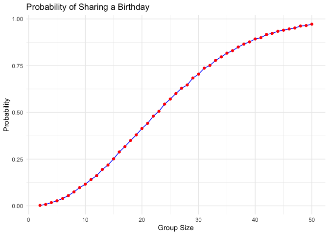
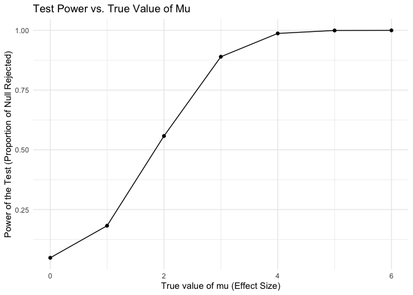
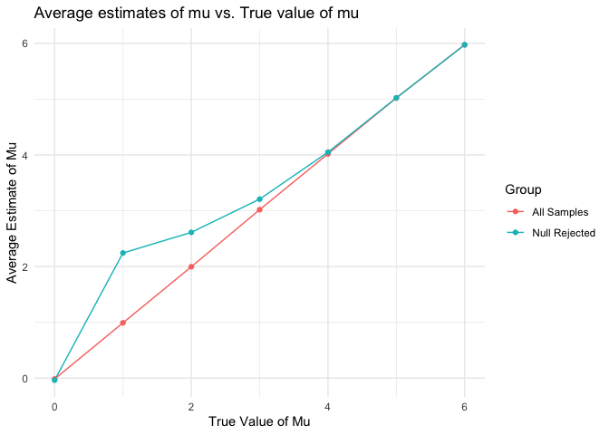
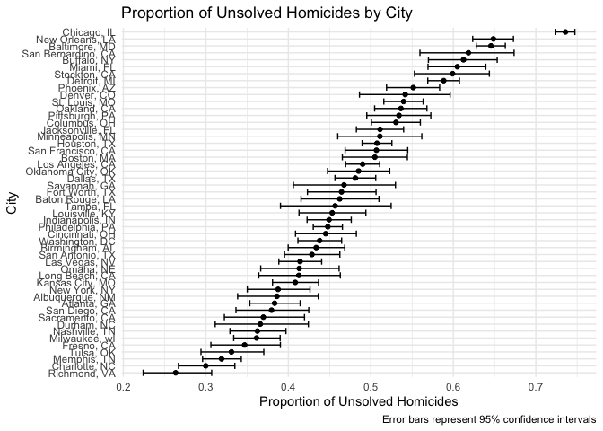

p8105_hw5_qc2337
================

Load all the package needed for this hw

``` r
library(tidyverse)
```

    ## ── Attaching core tidyverse packages ──────────────────────── tidyverse 2.0.0 ──
    ## ✔ dplyr     1.1.4     ✔ readr     2.1.5
    ## ✔ forcats   1.0.0     ✔ stringr   1.5.1
    ## ✔ ggplot2   3.5.1     ✔ tibble    3.2.1
    ## ✔ lubridate 1.9.3     ✔ tidyr     1.3.1
    ## ✔ purrr     1.0.2     
    ## ── Conflicts ────────────────────────────────────────── tidyverse_conflicts() ──
    ## ✖ dplyr::filter() masks stats::filter()
    ## ✖ dplyr::lag()    masks stats::lag()
    ## ℹ Use the conflicted package (<http://conflicted.r-lib.org/>) to force all conflicts to become errors

``` r
library(rvest)
```

    ## 
    ## Attaching package: 'rvest'
    ## 
    ## The following object is masked from 'package:readr':
    ## 
    ##     guess_encoding

``` r
library(broom)
library(knitr)
set.seed(1)
```

## Problem 1

for a fixed group size=10, checks whether there are duplicate birthdays
in the group

``` r
birthday_sim = function(n) {

  birthdays = sample(1:365, size = n, replace = TRUE)
  
  has_duplicate = length(unique(birthdays)) < n
  
  return(has_duplicate)
}

birthday_sim(10)
```

    ## [1] FALSE

``` r
results = tibble(group_size = 2:50) |> 
  mutate(
    probability = map_dbl(group_size, ~mean(replicate(10000, birthday_sim(.x))))
  )

results_plot=
  results |> 
  ggplot(aes(x = group_size, y = probability)) +
  geom_line(color = "blue") +
  geom_point(color = "red") +
  labs(
    title = "Probability of Sharing a Birthday",
    x = "Group Size",
    y = "Probability"
  ) +
  theme_minimal()

print(results_plot)
```

<!-- -->

Comment: with the group size getting larger, the higher that the
probability of the people in the group sharing a birthday.

## Problem 2

``` r
n = 30
sigma = 5
mu = 0:6
alpha = 0.05
simulations = 5000
```

``` r
simulate_t_test = function(mu, sigma = 5, n = 30) {
  x = rnorm(n, mean = mu, sd = sigma)
  test_result = t.test(x, mu = 0)
  tidy(test_result)
}

results = tibble(mu = rep(mu, each = simulations)) |> 
  mutate(
    sim_data = map(mu, ~simulate_t_test(.x)),
    estimate = map_dbl(sim_data, ~.x$estimate),
    p_value = map_dbl(sim_data, ~.x$p.value),
    reject_null = as.numeric(p_value < alpha)
  )

power_proportion = results |> 
  group_by(mu) |> 
  summarise(
    proportion_rejected = mean(reject_null),
    .groups = 'drop'
  )

power_proportion |> 
  ggplot(aes(x = mu, y = proportion_rejected)) +
    geom_line() +  
    geom_point() + 
    labs(
      title = "Test Power vs. True Value of Mu",
      x = "True value of mu (Effect Size)",
      y = "Power of the Test (Proportion of Null Rejected)"
  ) +
  theme_minimal()
```

<!-- -->

Describe the association between effect size and power: As the effect
size increases, the power of the test also increases. Initially, there
are rapid gains in power with small increases in effect size, followed
by more gradual improvements until the power effectively reaches its
maximum capacity.

plot showing the average estimate of 𝜇̂ on the y axis and the true value
of 𝜇on the x axis

``` r
average_estimates = results |> 
  group_by(mu) |> 
  summarise(
    avg_estimate_all = mean(estimate),
    avg_estimate_rejected = mean(estimate[reject_null == 1]),
    .groups = 'drop'
  )

average_estimates |> 
ggplot(aes(x = mu)) +
  geom_line(aes(y = avg_estimate_all, color = "All Samples")) +
  geom_line(aes(y = avg_estimate_rejected, color = "Null Rejected"))+
  geom_point(aes(y = avg_estimate_all, color = "All Samples")) +
  geom_point(aes(y = avg_estimate_rejected, color = "Null Rejected")) +
  labs(
       title = "Average estimates of mu vs. True value of mu",
       x = "True Value of Mu",
       y = "Average Estimate of Mu",
       color = "Group"
       ) +
  theme_minimal()
```

<!-- -->

In the sample average of 𝜇̂across tests for which the null is rejected is
not approximately equal to the true value of mu, it would overestimate
the mu when having smaller effect sizes.This indicates a systematic bias
where estimates from samples leading to null rejection are higher,
likely due to the effect of random sampling variability where more
extreme values are more likely to be observed and lead to rejection.When
the effect size is large enough, the sample estimates are naturally
closer to the true values.

## Problem 3

import data

``` r
 homicide_df =  
   read_csv("data/homicide_data.csv", na = c("NA",".","")) |> 
   janitor::clean_names()
```

    ## Rows: 52179 Columns: 12
    ## ── Column specification ────────────────────────────────────────────────────────
    ## Delimiter: ","
    ## chr (9): uid, victim_last, victim_first, victim_race, victim_age, victim_sex...
    ## dbl (3): reported_date, lat, lon
    ## 
    ## ℹ Use `spec()` to retrieve the full column specification for this data.
    ## ℹ Specify the column types or set `show_col_types = FALSE` to quiet this message.

Describe the raw data: The “homicide_df” have 52179 observations and 12
variables.The main variables include uid, reported_date, victim_last,
victim_first, victim_race, victim_age, etc.

make a new variable

``` r
homicide_summary= 
  homicide_df |> 
  mutate(
    city_state = paste(city, state, sep = ", ")
    ) |> 
  group_by(city_state) |> 
  summarise(
    total_homicides = n(),
    unsolved_homicides = sum(disposition %in% c("Closed without arrest", "Open/No arrest"), na.rm = TRUE),
    .groups = 'drop'
    )|> 
  filter(unsolved_homicides > 0)
  
kable(homicide_summary)
```

| city_state         | total_homicides | unsolved_homicides |
|:-------------------|----------------:|-------------------:|
| Albuquerque, NM    |             378 |                146 |
| Atlanta, GA        |             973 |                373 |
| Baltimore, MD      |            2827 |               1825 |
| Baton Rouge, LA    |             424 |                196 |
| Birmingham, AL     |             800 |                347 |
| Boston, MA         |             614 |                310 |
| Buffalo, NY        |             521 |                319 |
| Charlotte, NC      |             687 |                206 |
| Chicago, IL        |            5535 |               4073 |
| Cincinnati, OH     |             694 |                309 |
| Columbus, OH       |            1084 |                575 |
| Dallas, TX         |            1567 |                754 |
| Denver, CO         |             312 |                169 |
| Detroit, MI        |            2519 |               1482 |
| Durham, NC         |             276 |                101 |
| Fort Worth, TX     |             549 |                255 |
| Fresno, CA         |             487 |                169 |
| Houston, TX        |            2942 |               1493 |
| Indianapolis, IN   |            1322 |                594 |
| Jacksonville, FL   |            1168 |                597 |
| Kansas City, MO    |            1190 |                486 |
| Las Vegas, NV      |            1381 |                572 |
| Long Beach, CA     |             378 |                156 |
| Los Angeles, CA    |            2257 |               1106 |
| Louisville, KY     |             576 |                261 |
| Memphis, TN        |            1514 |                483 |
| Miami, FL          |             744 |                450 |
| Milwaukee, wI      |            1115 |                403 |
| Minneapolis, MN    |             366 |                187 |
| Nashville, TN      |             767 |                278 |
| New Orleans, LA    |            1434 |                930 |
| New York, NY       |             627 |                243 |
| Oakland, CA        |             947 |                508 |
| Oklahoma City, OK  |             672 |                326 |
| Omaha, NE          |             409 |                169 |
| Philadelphia, PA   |            3037 |               1360 |
| Phoenix, AZ        |             914 |                504 |
| Pittsburgh, PA     |             631 |                337 |
| Richmond, VA       |             429 |                113 |
| Sacramento, CA     |             376 |                139 |
| San Antonio, TX    |             833 |                357 |
| San Bernardino, CA |             275 |                170 |
| San Diego, CA      |             461 |                175 |
| San Francisco, CA  |             663 |                336 |
| Savannah, GA       |             246 |                115 |
| St. Louis, MO      |            1677 |                905 |
| Stockton, CA       |             444 |                266 |
| Tampa, FL          |             208 |                 95 |
| Tulsa, OK          |             583 |                193 |
| Washington, DC     |            1345 |                589 |

The table shows the total homicides in each city_state and total
unsolved homicides in 50 large U.S. cities.

use the prop.test for the city of Baltimore, MD

``` r
baltimore_data = 
  homicide_summary |> 
  filter(city_state == "Baltimore, MD")

unsolved = pull(baltimore_data, unsolved_homicides)
total = pull(baltimore_data, total_homicides)

prop_test_baltimore = prop.test(unsolved, total)|>
  broom::tidy()|>
  knitr::kable()
prop_test_baltimore
```

| estimate | statistic | p.value | parameter | conf.low | conf.high | method | alternative |
|---:|---:|---:|---:|---:|---:|:---|:---|
| 0.6455607 | 239.011 | 0 | 1 | 0.6275625 | 0.6631599 | 1-sample proportions test with continuity correction | two.sided |

run prop.test for each of the cities

``` r
unsolved_estimate_prop = function(unsolved, total) {
  test_result = prop.test(unsolved, total, correct = FALSE)
  broom::tidy(test_result) |> 
    select(estimate, conf.low, conf.high)
}

city_tests =
  homicide_summary |> 
  filter(total_homicides > 0) |> 
 mutate(
    prop_test_result = map2(unsolved_homicides, total_homicides, unsolved_estimate_prop)
  ) |>
  unnest(prop_test_result)

kable(city_tests)
```

| city_state | total_homicides | unsolved_homicides | estimate | conf.low | conf.high |
|:---|---:|---:|---:|---:|---:|
| Albuquerque, NM | 378 | 146 | 0.3862434 | 0.3385390 | 0.4362367 |
| Atlanta, GA | 973 | 373 | 0.3833505 | 0.3533160 | 0.4143023 |
| Baltimore, MD | 2827 | 1825 | 0.6455607 | 0.6277411 | 0.6629852 |
| Baton Rouge, LA | 424 | 196 | 0.4622642 | 0.4153589 | 0.5098471 |
| Birmingham, AL | 800 | 347 | 0.4337500 | 0.3998052 | 0.4683280 |
| Boston, MA | 614 | 310 | 0.5048860 | 0.4654318 | 0.5442795 |
| Buffalo, NY | 521 | 319 | 0.6122841 | 0.5697703 | 0.6531541 |
| Charlotte, NC | 687 | 206 | 0.2998544 | 0.2667821 | 0.3351526 |
| Chicago, IL | 5535 | 4073 | 0.7358627 | 0.7240874 | 0.7473108 |
| Cincinnati, OH | 694 | 309 | 0.4452450 | 0.4086712 | 0.4824216 |
| Columbus, OH | 1084 | 575 | 0.5304428 | 0.5006780 | 0.5599926 |
| Dallas, TX | 1567 | 754 | 0.4811742 | 0.4565119 | 0.5059287 |
| Denver, CO | 312 | 169 | 0.5416667 | 0.4862072 | 0.5961126 |
| Detroit, MI | 2519 | 1482 | 0.5883287 | 0.5689899 | 0.6073985 |
| Durham, NC | 276 | 101 | 0.3659420 | 0.3113154 | 0.4242491 |
| Fort Worth, TX | 549 | 255 | 0.4644809 | 0.4231532 | 0.5063022 |
| Fresno, CA | 487 | 169 | 0.3470226 | 0.3060909 | 0.3903488 |
| Houston, TX | 2942 | 1493 | 0.5074779 | 0.4894145 | 0.5255218 |
| Indianapolis, IN | 1322 | 594 | 0.4493192 | 0.4226906 | 0.4762415 |
| Jacksonville, FL | 1168 | 597 | 0.5111301 | 0.4824732 | 0.5397141 |
| Kansas City, MO | 1190 | 486 | 0.4084034 | 0.3808140 | 0.4365822 |
| Las Vegas, NV | 1381 | 572 | 0.4141926 | 0.3884862 | 0.4403751 |
| Long Beach, CA | 378 | 156 | 0.4126984 | 0.3641886 | 0.4629648 |
| Los Angeles, CA | 2257 | 1106 | 0.4900310 | 0.4694418 | 0.5106541 |
| Louisville, KY | 576 | 261 | 0.4531250 | 0.4129165 | 0.4939546 |
| Memphis, TN | 1514 | 483 | 0.3190225 | 0.2960277 | 0.3429333 |
| Miami, FL | 744 | 450 | 0.6048387 | 0.5692572 | 0.6393432 |
| Milwaukee, wI | 1115 | 403 | 0.3614350 | 0.3337565 | 0.3900649 |
| Minneapolis, MN | 366 | 187 | 0.5109290 | 0.4598697 | 0.5617612 |
| Nashville, TN | 767 | 278 | 0.3624511 | 0.3291947 | 0.3970784 |
| New Orleans, LA | 1434 | 930 | 0.6485356 | 0.6234581 | 0.6728194 |
| New York, NY | 627 | 243 | 0.3875598 | 0.3502203 | 0.4262687 |
| Oakland, CA | 947 | 508 | 0.5364308 | 0.5045870 | 0.5679803 |
| Oklahoma City, OK | 672 | 326 | 0.4851190 | 0.4475242 | 0.5228831 |
| Omaha, NE | 409 | 169 | 0.4132029 | 0.3665050 | 0.4615162 |
| Philadelphia, PA | 3037 | 1360 | 0.4478103 | 0.4302018 | 0.4655507 |
| Phoenix, AZ | 914 | 504 | 0.5514223 | 0.5190309 | 0.5833833 |
| Pittsburgh, PA | 631 | 337 | 0.5340729 | 0.4950623 | 0.5726711 |
| Richmond, VA | 429 | 113 | 0.2634033 | 0.2239537 | 0.3070524 |
| Sacramento, CA | 376 | 139 | 0.3696809 | 0.3224364 | 0.4195613 |
| San Antonio, TX | 833 | 357 | 0.4285714 | 0.3953688 | 0.4624298 |
| San Bernardino, CA | 275 | 170 | 0.6181818 | 0.5595067 | 0.6736007 |
| San Diego, CA | 461 | 175 | 0.3796095 | 0.3364772 | 0.4247317 |
| San Francisco, CA | 663 | 336 | 0.5067873 | 0.4688021 | 0.5446943 |
| Savannah, GA | 246 | 115 | 0.4674797 | 0.4061098 | 0.5298496 |
| St. Louis, MO | 1677 | 905 | 0.5396541 | 0.5157355 | 0.5633915 |
| Stockton, CA | 444 | 266 | 0.5990991 | 0.5528518 | 0.6436463 |
| Tampa, FL | 208 | 95 | 0.4567308 | 0.3904328 | 0.5245980 |
| Tulsa, OK | 583 | 193 | 0.3310463 | 0.2940621 | 0.3702425 |
| Washington, DC | 1345 | 589 | 0.4379182 | 0.4116177 | 0.4645723 |

Create a plot

``` r
city_tests |> 
ggplot(aes(x = reorder(city_state, estimate), y = estimate)) +
  geom_point(stat = "identity") + 
  geom_errorbar(aes(ymin = conf.low, ymax = conf.high)) +
  coord_flip() +
  labs(
    title = "Proportion of Unsolved Homicides by City",
    x = "City",
    y = "Proportion of Unsolved Homicides",
    caption = "Error bars represent 95% confidence intervals"
  ) +
  theme_minimal() 
```

<!-- -->
